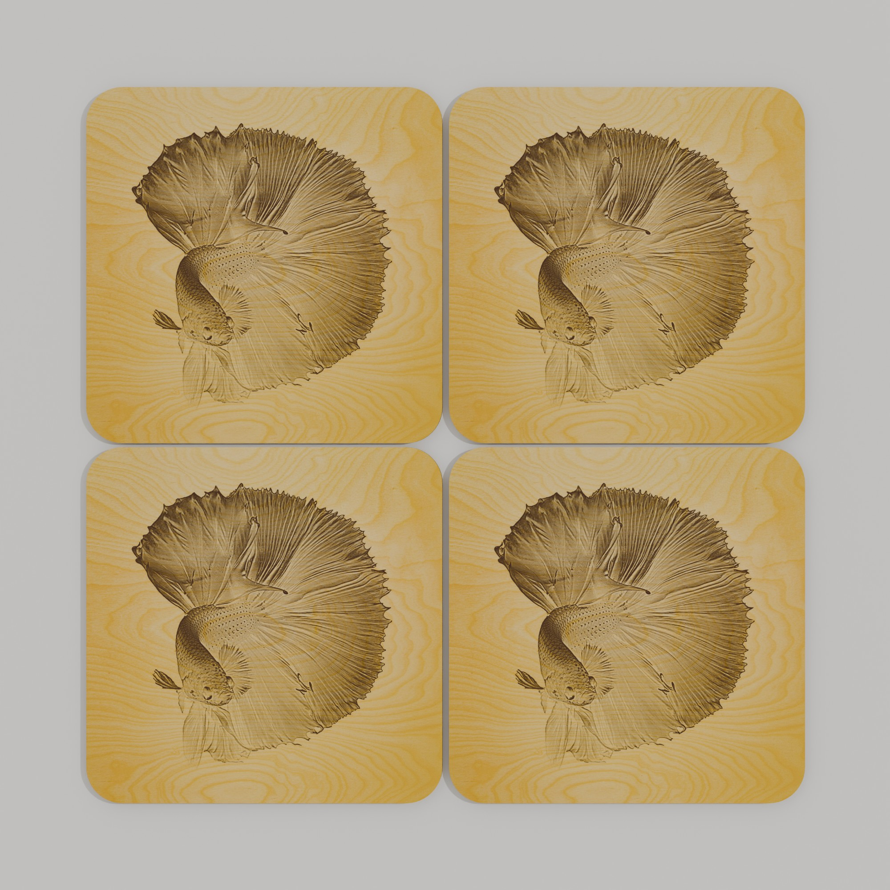
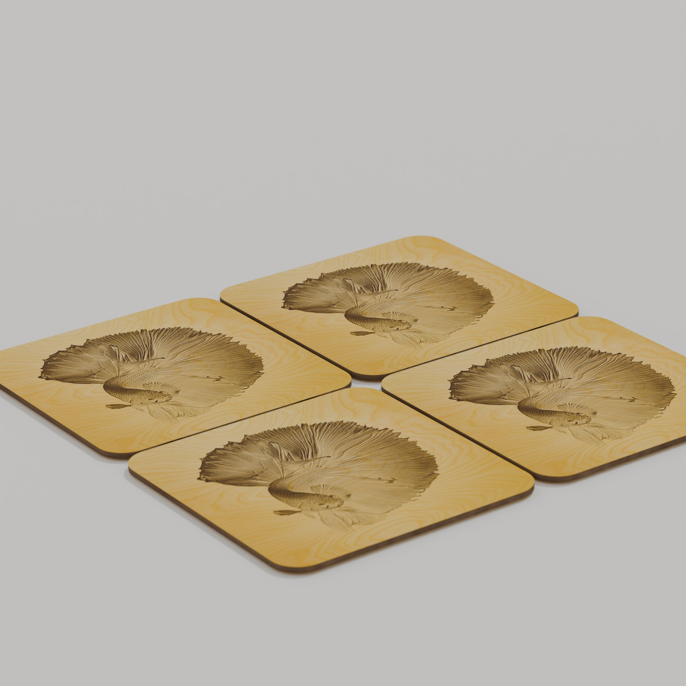

# Laser Blender Script

Blender add-ons for turning laser-cut SVG artwork into product-style 3D renders. The workflow is designed around a 300 mm x 200 mm SVG document, with red cut paths, blue vector engravings, grayscale raster engravings, and optional acrylic or painted wood layer naming.

Sample files:

- [starting-point.svg](starting-point.svg)
- [base_template.blend1](base_template.blend1)

## What It Does

`laser_svg_processor_v2.py` imports an SVG and converts it into renderable laser-cut parts:

- Full red outlines become cut parts.
- Cut parts are extruded to the configured material thickness.
- Full blue outlines become surface engraving decals.
- Grayscale fills become raster engraving decals.
- Embedded grayscale images become raster engraving decals.
- White raster areas are ignored; darker gray values burn progressively toward black.
- Birch plywood material is applied to normal wood faces.
- Dark burned material is applied to wood edges.
- Acrylic layers are rendered as glossy semi-transparent acrylic.
- The layer named `VIEWPORT` is ignored for extrusion/engraving but can remain in the SVG as a layout reference.

`render_cameras.py` adds a reusable studio setup:

- Product target empty.
- Multiple cameras.
- White studio backdrop.
- Diffused studio lights.
- Render settings tuned for product previews.

## Install The Add-ons

Open Blender 5.1, then install both Python files:

1. Open `Edit > Preferences`.
2. Go to `Add-ons`.
3. Click the install button.
4. Select [laser_svg_processor_v2.py](laser_svg_processor_v2.py).
5. Enable `Laser SVG Processor`.
6. Repeat the same process for [render_cameras.py](render_cameras.py).
7. Enable `Laser Render Studio Cameras`.


After installation, the operators are available from Blender's Object menu and through `F3` search.

## Prepare The SVG

The SVG should be authored as a 300 mm x 200 mm document. The script treats the SVG document as that physical size and scales all imported elements accordingly.

Use these conventions:

| SVG content | Meaning in Blender |
| --- | --- |
| Red stroke, no fill | Laser cut outline, extruded as a 3D part |
| Blue stroke, no fill | Vector engraving decal on top of the part |
| Grayscale fill | Raster engraving decal |
| Embedded grayscale image | Raster engraving decal |
| White raster pixels | Ignored |
| Black raster pixels | Full burn |
| Gray raster pixels | Partial burn |
| `VIEWPORT` layer | Layout/reference only, not extruded |

Example source SVG with four raster images and red cut outlines:


The sample [starting-point.svg](starting-point.svg) demonstrates this setup.

## Layer Naming

Layer names can control material appearance.

For acrylic, name a red cut layer using:

```text
[colour]-acrylic
```

Examples:

```text
clear-acrylic
blue-acrylic
red-acrylic
```

`clear-acrylic` renders as glossy clear acrylic. Other acrylic colours render as tinted transparent acrylic.

For painted/tinted wood, use a colour name without `-acrylic`:

```text
red
blue
green
brown
```

Supported colour names include red, vermilion, orange, amber, yellow-orange, yellow, chartreuse, lime, yellow-green, green, emerald, spring-green, cyan, turquoise, blue-cyan, blue, azure, indigo, blue-violet, violet, purple, magenta, rose, crimson, black, white, light-brown, brown, and dark-brown.

Wood tint behaves like painted wood: the specified colour is dominant, but the plywood grain still shows through.

## Process An SVG

1. Start from an empty scene or open [base_template.blend1](base_template.blend1).
2. Press `F3`.
3. Search for `Laser SVG Processor`.
4. Choose your SVG file.
5. Confirm the import.


The file browser opens so you can select the SVG:


The script imports the SVG, scales it to the configured document size, creates individual 3D cut objects, applies materials, and places engraving decals on the top faces.

Initial import view:


Processed result with cut parts and raster engravings:


## Recommended Settings

The default SVG processor settings are intended for the current workflow:

| Setting | Default | Notes |
| --- | --- | --- |
| SVG Document Width | `0.3 m` | Represents 300 mm |
| SVG Document Height | `0.2 m` | Represents 200 mm |
| Material Thickness | Script default | Adjust if your material thickness differs |
| Outline Close Tolerance | Script default | Helps close small gaps in red cut outlines |
| Require SVG Source For Blue Detection | On | Keeps stroke colour detection reliable |
| Treat Unrecognised Curves As Cut Parts | On | Useful for SVG imports with incomplete metadata |

If blue engravings or raster decals do not appear, re-run the operator from the SVG file rather than processing already-imported curves manually. The script reads the original SVG source to recover stroke colours, fills, transforms, and embedded image data.

## Raster Engraving Notes

Raster engraving works best when images are embedded in the SVG and use a white background with grayscale artwork:

- White becomes transparent/no burn.
- Light gray becomes a light burn.
- Dark gray becomes a strong burn.
- Black becomes the darkest burn.

On wood, raster engraving appears as a burned decal. On acrylic, raster engraving appears as a subtle etched/carved surface effect rather than brown burning.

Rendered sample output:





## Set Up Cameras And Studio Lighting

After processing the SVG:

1. Press `F3`.
2. Search for `Set Up Laser Render Cameras`.
3. Run the operator.
4. Use the generated cameras for rendering.

The camera add-on creates a white studio-like setup with diffused shadows. It also sets up cameras such as:

- `Camera_Front_3Q`
- `Camera_Top`
- `Camera_Closeup`
- `Camera_Side_3Q`

The active camera is set to `Camera_Front_3Q`.

## Render Workflow

1. Process the SVG with `Laser SVG Processor`.
2. Run `Set Up Laser Render Cameras`.
3. Choose a camera from the scene camera list if needed.
4. Render with EEVEE or Cycles.
5. For final product images, use higher samples and render resolution.

The included [base_template.blend1](base_template.blend1) can be used as a starting scene for repeatable product renders.

## Troubleshooting

If cuts are missing, check that cut outlines are red strokes and not filled shapes.

If engravings are missing, check that vector engravings use blue strokes or that raster engravings are grayscale fills/images.

If raster images appear as solid rectangles, confirm that the latest add-on file is installed and enabled. The current script converts white raster areas into transparency before applying the decal.

If acrylic appears like wood, check that the cut layer name ends in `-acrylic`.

If objects are the wrong size, confirm that the SVG document is authored for 300 mm x 200 mm and that the processor settings still use `0.3 m` by `0.2 m`.

If Blender appears to use an old version of the script, disable and re-enable the add-on, or remove the installed copy from Blender's add-ons folder and reinstall from this repository.
